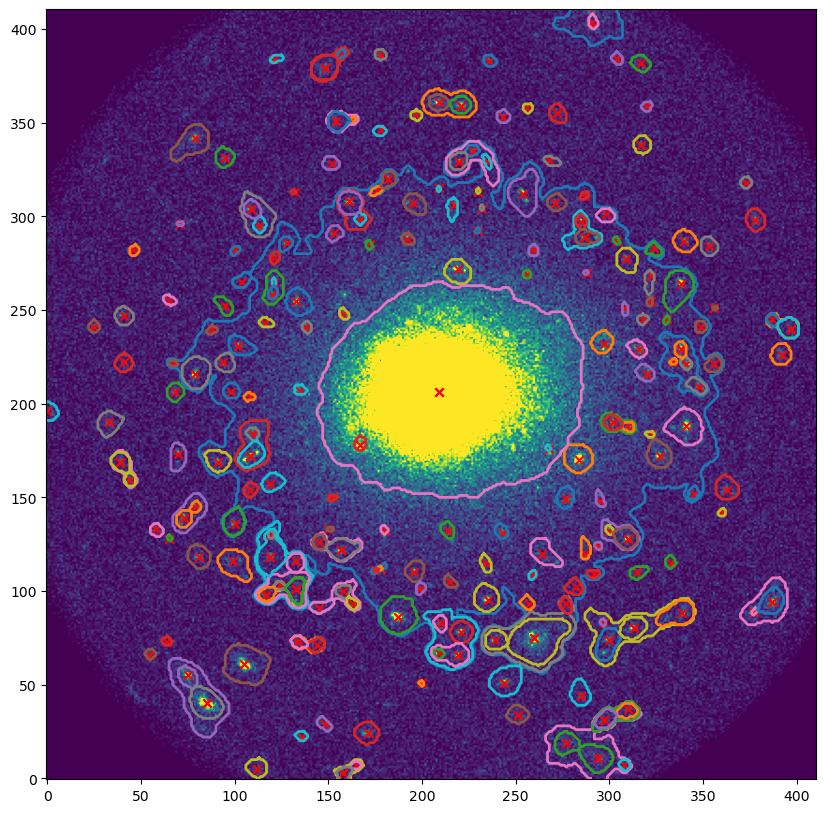

# this is an old version of the code now called DRUID. Please use DRUID instead:

[DRUID LINK](https://github.com/RhysAlfShaw/DRUID)

# TRSF (A General purpose Source Finder for Astronomical Images.)

[](https://github.com/RhysAlfShaw/TRSF/actions/workflows/pytest.yaml)
[](https://codecov.io/gh/RhysAlfShaw/TRSF-dev)

[TRSF-dev GitHub Repository](https://github.com/RhysAlfShaw/TRSF-dev)


Currently in development, a general tool for astronomers to find sources, returning a catalogue and list of component polygons that the sources were extracted from. 

This source finder uses Persistent Homology to find peaks, saddle points and define components of source islands.

To calculate the persistent homology of the input images we use the code ```cripser``` by Shizuo Kaji [cripser](https://github.com/RhysAlfShaw/CubicalRipser_3dim). 

## Warning 

This repository is actively in development and is susceptible to regular and breaking changes.

# To use

To use the development version of this code please download this repository to your machine,
install the dependencies in the requirement.txt with

```bash
pip install -r requirements.txt
```
Create a file in the directory or link to the module with your import command e.g.

```python
from TRSF import sf

findmysources = sf()
```

# Example X-ray Source.

Here is an example of TRSF source finding with a X-ray image from eROSITA [Link](https://erosita.mpe.mpg.de/edr/eROSITAObservations/).

The image used in this example can be downloaded from [Link](https://erosita.mpe.mpg.de/edr/eROSITAObservations/CalPvObs/A3158.tar.gz)
This is a pointing centered on Galaxy Cluster A3158 at 55.73deg -53.63deg (R.A | Dec).

```python
from TRSF import sf
import numpy as np
import matplotlib.pylab as plt
from astropy.io import fits

File_Path = 'Xray_observation.fits'

# open data
hdulist = fits.open(Data_Path)

# crop the nans from the image (not always present in your image)
data = hdulist[0].data[~np.isnan(hdulist[0].data).all(axis=1)]
data = data[:,~np.isnan(data).all(axis=0)]

# apply some smoothing by covolving the image with a gaussian kernal.

from scipy.ndimage.filters import gaussian_filter
data_not_smoothed = np.copy(data)
data = gaussian_filter(data, sigma=3)

# initialise the source finder instance with your file path, and type of image.
findmysources = sf(image=data,image_PATH=None,pb_PATH=None,mode='other')
# calculate background statistics relevent for you image.
fimdmysources.set_background(detection_threshold=1,set_bg=2)
# find the topological features.
findmysources.phsf()
# Create a list of polygons defining the regions of sources found by phsf().
findmysources.create_polygons()
# read from the object the catalogue and polygons.
catalogue = findmysources.catalogue
polygons = findmysources.polygons
```
Output:
```
Background set to:  2
Persis Diagram computed. Length:  238 
Calculating area: 100%|██████████| 238/238 [00:00<00:00, 1258.66it/s]
Making point assoc: 100%|██████████| 206/206 [00:01<00:00, 139.00it/s]
Correcting first destruction: 100%|██████████| 206/206 [00:00<00:00, 16495.98it/s]
Creating polygons: 100%|██████████| 239/239 [00:00<00:00, 769.75it/s]
```

To see the catalogue that we have created. Since we have not measured any features form the sources, we only return columns from extracting the topological features.


```python
catalogue
```

Output:

```
	Birth	Death	x1	y1	x2	y2	lifetime	area	enclosed_i	new_row	parent_tag	Class
0	167.562332	2.0	206.0	209.0	0.0	0.0	165.562332	51671	[1, 2, 3, 7, 8, 9, 10, 12, 13, 14, 15, 17, 19,...	0	NaN	2
1	18.719332	6.055056	170.0	284.0	177.0	277.0	12.664276	164	[]	0	0.0	1
2	17.801456	2.296226	86.0	187.0	96.0	194.0	15.50523	277	[]	0	0.0	1
3	15.797917	14.636652	178.0	167.0	183.0	167.0	1.161265	28	[]	0	0.0	1
4	15.430809	2.0	40.0	85.0	55.0	137.0	13.430809	678	[16]	0	NaN	2
...	...	...	...	...	...	...	...	...	...	...	...	...
148	2.447489	2.105456	31.0	297.0	26.0	291.0	0.436651	183	[161]	1	59.0	3
160	2.395008	2.14169	320.0	182.0	312.0	172.0	0.264016	68	[182]	1	0.0	3
171	2.252562	2.023993	73.0	134.0	77.0	147.0	0.252562	84	[173]	1	NaN	3
178	2.200984	2.063562	3.0	158.0	14.0	170.0	0.200984	73	[212]	1	NaN	3
190	2.164749	2.069864	93.0	163.0	96.0	152.0	0.164749	119	[201]	1	NaN	3
```

Now lets plot the image with polygons we have for the sources with a marker at the birth location of the features.

```Python
plt.figure(figsize=(10,10))
plt.imshow(data_not_smooth,origin='lower',vmax=20)
plt.scatter(catalogue['y1'],catalogue['x1'],marker='x',color='red')
for i in range(len(findmysources.polygons)):
    polygon = findmysources.polygons[i]
    plt.plot(polygon[:,1],polygon[:,0],linewidth=2)
plt.show()
```



# Bugs / Issues

Please report any issues to the issues tab on the github page and proveide as much details as possible.
